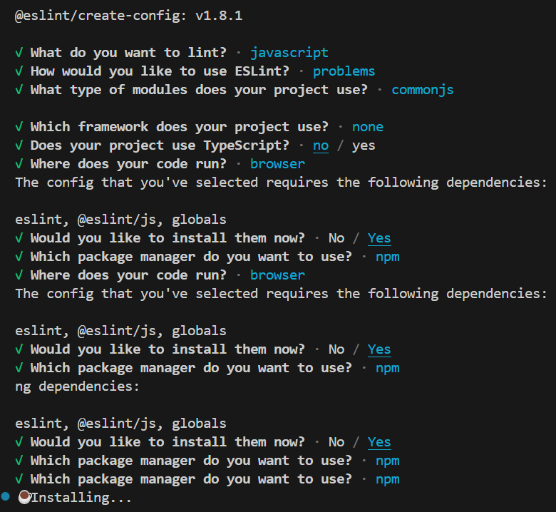
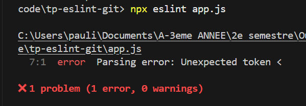
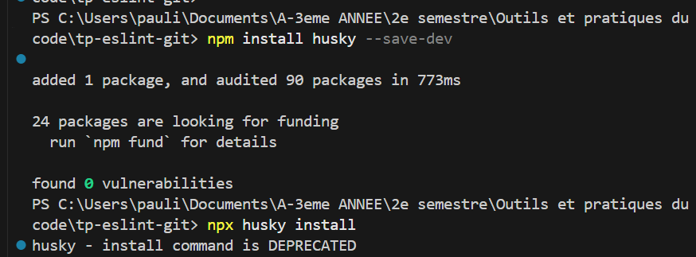
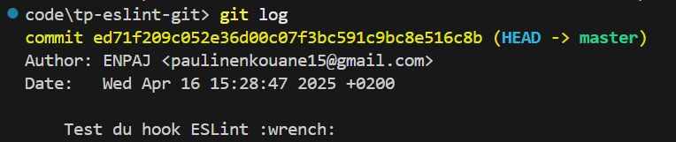
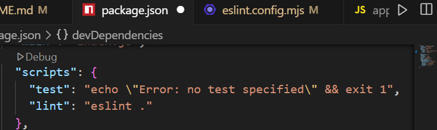
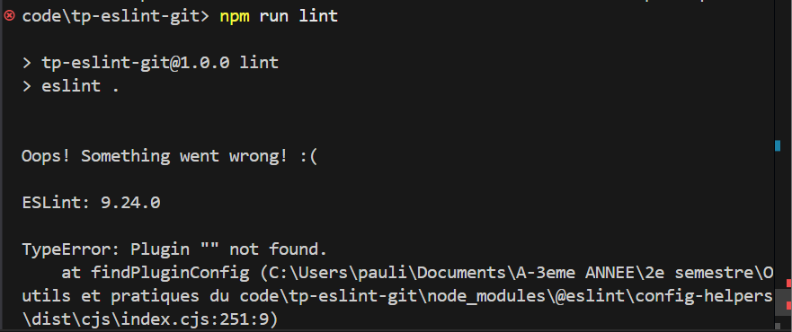
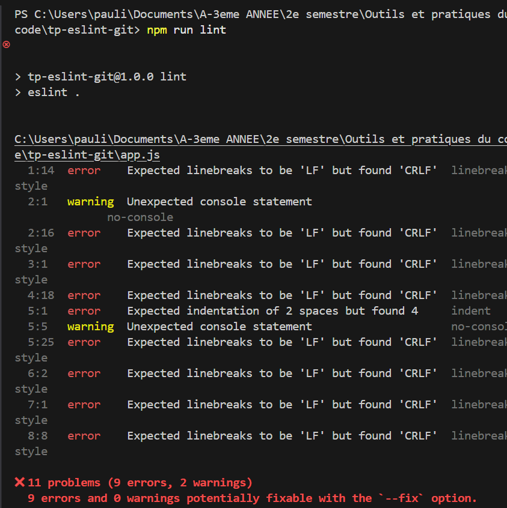

## Partie 1
Installation fluide via VS Code


## Partie 2
Avec le code app.js que vous nous avez fournis, je n'ai pas eu d'erreur en lancant *npx eslint app.js* alors j'en ai cree en ajoutant des balises *<html> et <script>*

npx eslint app.js
```bash
tp-eslint-git\app.js      
  7:1  error  Parsing error: Unexpected token <     

✖ 1 problem (1 error, 0 warnings)
```


npx eslint --fix app.js
```bash
tp-eslint-git\app.js      
  7:1  error  Parsing error: Unexpected token <     

✖ 1 problem (1 error, 0 warnings)
```

J'ai ensuite corriger le fichier manuellement. Apres l'avoir corrige, j en'ai plus eu d'erreur en lancant *npx eslint app.js*


## Partie 3
installation de husky sans problem tick


Ajout du hook *pre-commit* tick et test du hook avec le commit *git commit -m "Test du hook ESLint"*


## Partie 4
Configuration ESLint
je devais modifier *.eslintrc.json* mais mon fichier de config ESLint est en *.mjs* je l'ai neanmoins modifier afin qu'il corresponde aux modifications que vous aviez. Ce qui donne :
```js
import js from '@eslint/js';
import globals from 'globals';
import { defineConfig } from 'eslint/config';

export default defineConfig([
  {
    files: ['**/*.{js,mjs,cjs}'],
    plugins: { js },
    languageOptions: {
      globals: {
        ...globals.browser,
        ...globals.node,
      },
      sourceType: 'module',
    },
    extends: ['airbnb-base'],
    rules: {
      'no-console': 'warn',
      'indent': ['error', 2],
      'quotes': ['error', 'single'],
    },
  },
]);
```

Ajout de lint dans *package.json*


En ajoutant *npm run lint* j'ai eu des erreurs:


C'est du au fait que dans mon fichier *eslint.config.mjs* 
j'avais mis 
```js
    plugins: { js },
```
Mais le plugin *js* de *@eslint/js* n’est pas un vrai plugin ESLint à inclure dans *plugins*
Alors j'ai supprime cette ligne. Et relance :
```bash
npm install --save-dev eslint eslint-config-airbnb-base eslint-plugin-import
```
pour installer les packages *eslint,eslint-config-airbnb-base* et *eslint-plugin-import*

Apres cela j'avais encore des erreurs, j'ai fais des recherche et j'ai vu que c'etait du au fait que j'avais ESLint version 9.24.0, or eslint-config-airbnb-base@15 ne supporte que ESLint v7 ou v8`, d’où l’erreur de peer dependencies. Je devais donc Tu peux désinstaller ESLint 9 et installer ESLint 8 puis installer airbnb-base et ses dépendances.
```bash
npm uninstall eslint
npm install --save-dev eslint@8
```
```bash
npm install --save-dev eslint-config-airbnb-base eslint-plugin-import
```
J'ai relance *npm run lint* et j'avais encore des erreurs, cette fois ci parce que vu que je suis passé à ESLint v8 (compatibilité avec airbnb-base), je dois utiliser le fichier .eslintrc (JSON ou JS) et supprimer eslint.config.mjs.

### EUREKA !!! 🎯✅ 
Enfin je n'ai plus de probleme de config
j'ai relancé *npm run lint* et le resultat dans le terminal était

⚠️ Les erreurs linebreak-style (LF vs CRLF) viennent du fait que mon éditeur (VS Code sous Windows) insère des retours chariot au format Windows (CRLF), alors qu'ESLint attend des retours au format Unix (LF).
Pour corriger cela j'ai fait
```bash
npm run lint -- --fix
```
Pour 💡 Forcer LF pour tous les fichiers du projet afin que cette erreur ne se reproduise plus, j'ai cree le fichier *.editorconfig*

- Creation du workflow
```bash
mkdir -p .github/workflows/lint.yml
```
